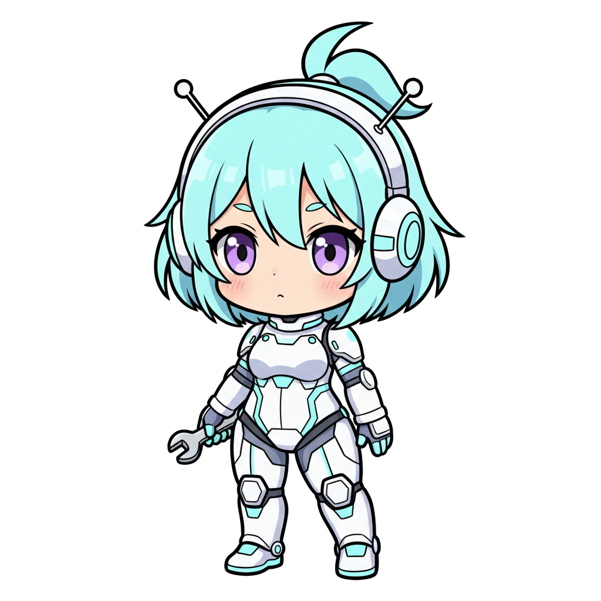
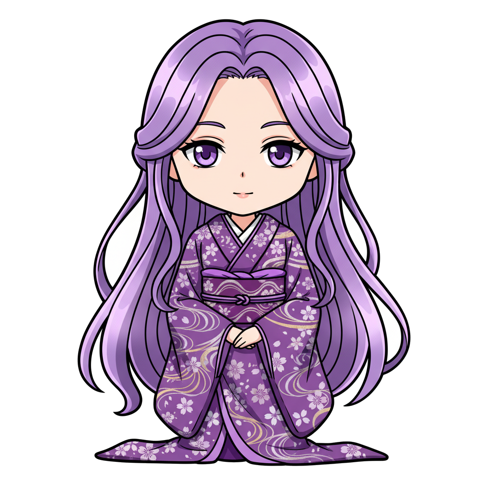
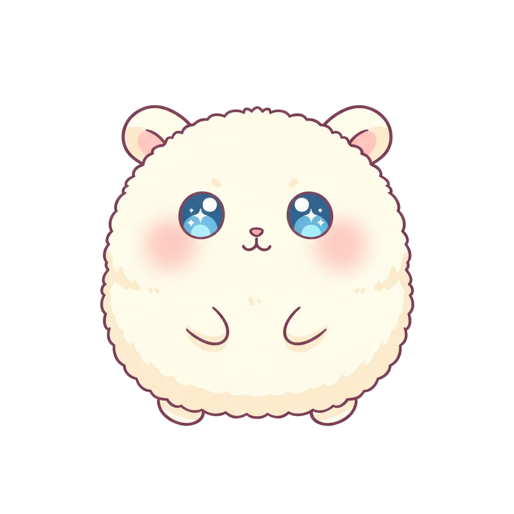
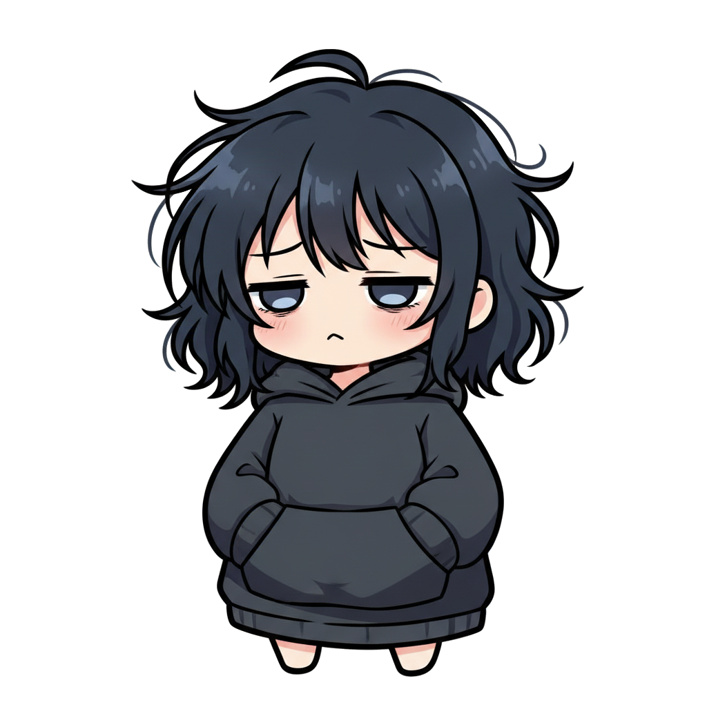

# Remotion + Qwen3-TTS 動画テンプレート

オリジナルキャラクターの掛け合い紹介動画を簡単に作成できるテンプレートです。
Apple Silicon Mac上でローカルTTS（Qwen3-TTS）を使用して音声生成します。


https://github.com/user-attachments/assets/a0bba0e6-5497-45a9-b4ab-ecb0974d544a


## 特徴

- **ローカルTTS** - Qwen3-TTS（MLX）でApple Silicon上で高速音声生成
- **口パクアニメーション** - 音声波形に同期した自然な口パク
- **対話的な動画作成** - Claude Codeと会話しながら動画を作成
- **表情差分対応** - happy, surprised, thinking, sad などの表情切り替え
- **BGM・効果音対応** - 場面に合わせた音声演出
- **カスタマイズ可能** - YAMLファイルでフォント、色、レイアウトを簡単変更

---

## クイックスタート

### 1. 必要なもの

| 必要環境 | 説明 |
|--------|------|
| Apple Silicon Mac | M1/M2/M3/M4チップ搭載のMac |
| [Node.js 18+](https://nodejs.org/) | JavaScript実行環境 |
| Python 3.10+ | 音声生成スクリプト用 |
| [Claude Code](https://claude.ai/code) | 対話的に動画を作成（推奨） |

### 2. セットアップ

```bash
git clone https://github.com/kazuph/remotion-tts-template.git my-video
cd my-video
npm install

# Python仮想環境のセットアップ
python3 -m venv .venv
source .venv/bin/activate

# MLX関連パッケージのインストール
pip install git+https://github.com/Blaizzy/mlx-audio.git soundfile numpy

# 検証用（Whisper）
pip install mlx-whisper
```

### 3. プレビューサーバーを起動

```bash
npm start
```

ブラウザで http://localhost:3000 を開くとプレビューが表示されます。
デモ用のセリフと音声が含まれているので、すぐに動作確認できます。

### 4. 動画を作成（Claude Code使用時）

```bash
claude  # 別ターミナルでClaude Codeを起動
```

Claude Codeに話しかけるだけ：

```
「〇〇の紹介動画を作りたい」
```

---

## 作業フロー

```
┌─────────────────────────────────────────────────────────────────┐
│                         準備                                    │
│  ┌──────────┐    ┌──────────┐    ┌──────────┐                 │
│  │ Node.js  │    │  Python  │    │  Claude  │                 │
│  │ インストール│    │   venv   │    │   起動   │                 │
│  └──────────┘    └──────────┘    └──────────┘                 │
└─────────────────────────────────────────────────────────────────┘
                              │
                              ▼
┌─────────────────────────────────────────────────────────────────┐
│  1. セリフ作成                                                   │
│     「〇〇の紹介動画を作りたい」                                  │
│                              │                                  │
│                              ▼                                  │
│     Claude がセリフを自動生成 → src/data/script.ts               │
└─────────────────────────────────────────────────────────────────┘
                              │
                              ▼
┌─────────────────────────────────────────────────────────────────┐
│  2. 音声生成（Qwen3-TTS）                                        │
│     「音声を生成して」                                            │
│                              │                                  │
│                              ▼                                  │
│     MLXでローカル音声生成 → public/voices/*.wav                  │
│     口パクデータも同時生成 → src/data/mouth-data.generated.ts    │
└─────────────────────────────────────────────────────────────────┘
                              │
                              ▼
┌─────────────────────────────────────────────────────────────────┐
│  3. プレビュー・修正                                              │
│     「プレビュー見せて」                                          │
│                              │                                  │
│              ┌───────────────┴───────────────┐                  │
│              ▼                               ▼                  │
│         問題なし                          修正あり               │
│              │                    「ID 3のセリフを変えて」        │
│              │                               │                  │
│              │                               ▼                  │
│              │                    セリフ修正 → 音声再生成         │
│              │                               │                  │
│              └───────────────┬───────────────┘                  │
│                              │                                  │
└──────────────────────────────┼──────────────────────────────────┘
                              │
                              ▼
┌─────────────────────────────────────────────────────────────────┐
│  4. 動画出力                                                     │
│     「動画を出力して」                                            │
│                              │                                  │
│                              ▼                                  │
│     Remotion でレンダリング → out/video.mp4  🎉                  │
└─────────────────────────────────────────────────────────────────┘
```

---

## よく使う指示

| やりたいこと | 指示の例 |
|-------------|---------|
| 新規作成 | 「〇〇の紹介動画を作って」 |
| セリフ修正 | 「ID 3のセリフを変更して」 |
| 発音修正 | 「GitHubをギットハブって発音して」 |
| 音声生成 | 「音声を生成して」 |
| プレビュー | 「プレビュー見せて」 |
| 動画出力 | 「動画を出力して」 |

---

## コマンド一覧

| コマンド | 説明 |
|---------|------|
| `npm start` | プレビュー（http://localhost:3000） |
| `.venv/bin/python scripts/generate-voices-qwen.py` | 音声生成（Qwen3-TTS） |
| `npm run build` | 動画出力（out/video.mp4） |
| `npm run init` | 新規プロジェクト初期化 |

---

## キャラクターシステム

### デフォルトキャラクター

テンプレートには5人のオリジナルキャラクターが含まれています（すべてGemini APIで生成）。

<table>
  <tr>
    <td align="center" width="33%">
      <br>
      <b>あおい</b><br>
      ロボット女子<br>
      <code>#00BFFF</code>
    </td>
    <td align="center" width="33%">
      <br>
      <b>むらさき</b><br>
      知的な着物美人<br>
      <code>#9932CC</code>
    </td>
    <td align="center" width="33%">
      <br>
      <b>もふも</b><br>
      もふもふ小動物<br>
      <code>#FFB6C1</code>
    </td>
  </tr>
  <tr>
    <td align="center">
      <br>
      <b>よる</b><br>
      パーカー女子<br>
      <code>#4169E1</code>
    </td>
    <td align="center">
      <br>
      <b>どこ</b><br>
      人探し中！<br>
      <code>#7B9E89</code>
    </td>
    <td align="center">
    </td>
  </tr>
</table>

各キャラクターには5種類の表情（normal, happy, surprised, thinking, sad）と口パク用の画像が用意されています。

### キャラクター設定（characters.yaml）

`characters.yaml`でキャラクターを定義します：

```yaml
characters:
  aoi:
    name: "あおい"
    description: "ロボット女子。耳からアンテナが生えている。元気で明るい。"
    voice_instruct: "元気いっぱいで明るい少女の声。テンション高めでハキハキと話す"
    color: "#00BFFF"
    position: "right"  # 画面右側に表示

  murasaki:
    name: "むらさき"
    description: "紫の着物を着た知的な女性。クールで落ち着いている。"
    voice_instruct: "知的でクールな大人の女性の声。落ち着いていて淡々と話す"
    color: "#9932CC"
    position: "left"   # 画面左側に表示
```

キャラクターを追加・変更したら `npm run sync-settings` を実行してください。

### 画像ファイル構成

```
public/images/{characterId}/
├── mouth_close.png      # 基本・口閉じ（必須）
├── mouth_open.png       # 基本・口開き（必須）
├── happy_close.png      # happy表情・口閉じ
├── happy_open.png       # happy表情・口開き
├── surprised_close.png  # surprised表情
├── surprised_open.png
├── thinking_close.png   # thinking表情
├── thinking_open.png
├── sad_close.png        # sad表情
└── sad_open.png
```

### 新しいキャラクターの追加

1. `characters.yaml`にキャラクター定義を追加
2. `public/images/{id}/`にフォルダを作成
3. 画像を配置（最低限 `mouth_close.png`, `mouth_open.png`）
4. `npm run sync-settings`を実行

画像生成には **[skills/gemini-character-creator/](./skills/gemini-character-creator/)** のスキルが使用できます。

---

## 音声生成の設定

### キャラクター音声

音声のスタイルは`characters.yaml`の`voice_instruct`で設定します。
`scripts/generate-voices-qwen.py`はこのファイルを自動で読み込みます。

### 再生速度

`src/config.ts`で再生速度を調整：

```typescript
export const VIDEO_CONFIG = {
  fps: 30,
  playbackRate: 1.2,  // 音声を1.2倍速で再生
};
```

---

## カスタマイズ

`video-settings.yaml`でスタイルを変更できます：

```yaml
font:
  family: "Noto Sans JP"
  size: 48
  color: "#ffffff"

character:
  height: 275
  useImages: true

colors:
  zundamon: "#228B22"
  metan: "#FF1493"
```

---

## BGM・効果音

効果音を追加して動画をより魅力的に：

```typescript
// セリフに効果音を追加
{
  text: "ここがポイントなのだ！",
  se: { src: "point.mp3", volume: 0.8 },
}
```

効果音の入手方法は **[効果音ガイド](./docs/sound-effects-guide.md)** を参照してください。

---

## 詳しい使い方

詳細は **[CLAUDE.md](./CLAUDE.md)** を参照してください。

Qwen3-TTSでの動画生成の詳細は **[skills/remotion-qwen-tts/](./skills/remotion-qwen-tts/)** を参照してください。

---

## ライセンス

MIT License

### キャラクター素材について

- **オリジナルキャラクター**（aoi, murasaki, mofumo, yoru, doko）: Gemini APIで生成
